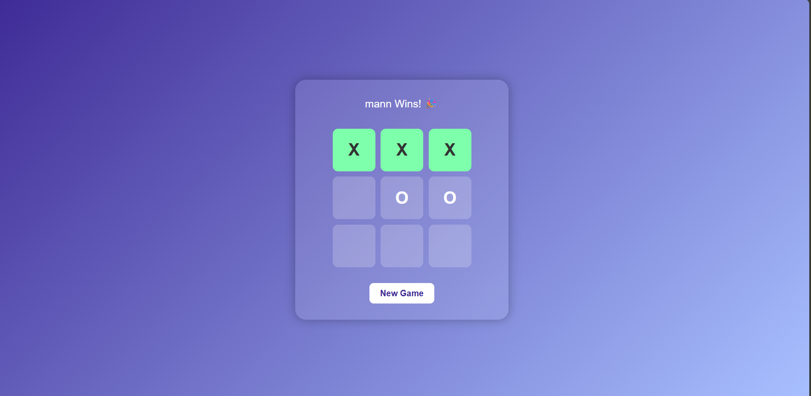

# 🎮 Tic-Tac-Toe Game

This is a clean and modern web-based **Tic-Tac-Toe game** built using **HTML**, **CSS**, and **JavaScript**. Two players can enter their names and play alternately. The game highlights winning combinations and allows players to restart the game easily.

## 🚀 Features

- 🎨 Beautiful gradient background and responsive layout
- 👤 Two-player mode with name input
- 🧠 Real-time game logic with turn-switching
- ✨ Winning animation for the winning boxes
- 🔁 Reset button to play again

## 🛠️ Tech Stack

- **HTML**
- **CSS**
- **JavaScript (Vanilla JS)**

## 📸 Screenshots

 <!-- (You can add a screenshot.png file here later) -->

## 📂 How to Use

1. Clone the repository:
   ```bash
   git clone https://github.com/mangautam27/Tic-Tac-Toe-game.git
2. Open index.html in your browser.

3. Enter the names of both players.

4. Start playing!

🙌 Author
Made with ❤️ by Man Gautam
